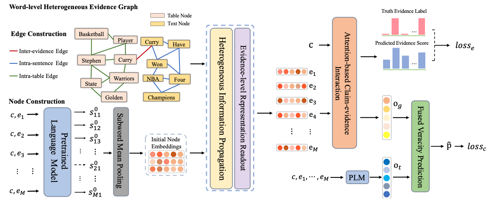

# Heterogenous Graph Reasoning for Fact Checking over Texts and Tables



Accepted by AAAI-24, check our paper at https://arxiv.org/abs/2402.13028
If you find it useful, please consider citing:
```
@inproceedings{gong2024heterogeneous,
  title={Heterogeneous Graph Reasoning for Fact Checking over Texts and Tables},
  author={Gong, Haisong and Xu, Weizhi and Wu, Shu and Liu, Qiang and Wang, Liang},
  booktitle={Proceedings of the AAAI Conference on Artificial Intelligence},
  volume={38},
  number={1},
  pages={100--108},
  year={2024}
}
```

## Preparation

1. Download [Roberta pretrained model](https://huggingface.co/ynie/roberta-large-snli_mnli_fever_anli_R1_R2_R3-nli) and put related files into directory `roberta-large-snli_mnli_fever_anli_R1_R2_R3-nli/`

2. Prepare dataset and Wikidump. [Link](https://fever.ai/dataset/feverous.html). As a result, you should rename the wikidump to `feverous_wikiv1.db` as well as the dataset splits: `train.jsonl`,`dev.jsonl` and `test.jsonl`.

3. Follow [DCUF](https://aclanthology.org/2022.naacl-main.384)'s work and generate retrieved evidence files for the three splits. See [GitHub Link](https://github.com/lanlanabcd/dual_
channel_feverous)  for more instruction on generating retrieved evidence file. After the retrieval process, the results should be three files named as `dev.combined.not_precomputed.p5.s5.t3.cells.jsonl`, `train.combined.not_precomputed.p5.s5.t3.cells.jsonl` and `test.combined.not_precomputed.p5.s5.t3.cells.jsonl`.

## Run our code

4. Run `python train.py` to run the training process. It includes a preprocess procedure for the dataset splits and evaluation on dev split.

5. To evaluate the performance on test split, [online judge](https://eval.ai/web/challenges/challenge-page/1091/overview) is needed. You can also check our submission result on the online judge system. To generate file to submit run the following code: `python testresult.py; python generatesubmitfile.py --input_file tosubmit.csv`
